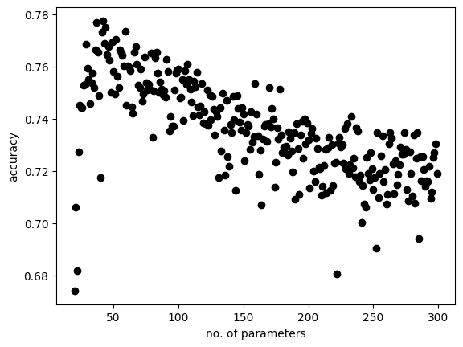
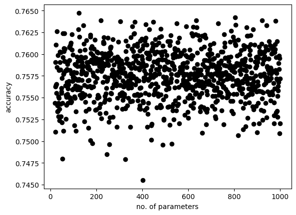

# cdot

<pre>
https://github.com/schustda/CDOT-Project-Estimator
Colorado Department of Transportation (CDOT) construction projects
for accurately predicting constructions costs

instances: 1458 
parameters:8751 

extratrees:features and splits are randomly selected.
randomforest:wisdom of the crowd

</pre>

# how to download train.csv, test.csv and cdot_data.csv

https://github.com/schustda/CDOT-Project-Estimator/raw/master/data/model/train.csv

https://github.com/schustda/CDOT-Project-Estimator/raw/master/data/model/test.csv

https://github.com/schustda/CDOT-Project-Estimator/raw/master/data/data/cdot_data.csv

<pre>

$ head -1 train.csv|grep -o 'bid[^*,]*'
bid_total
bid_days

$ wc cdot_data.csv 
    1459     1460 39005871 cdot_data.csv
$ wc test.csv 
    366     366 9829992 test.csv
$ wc train.csv 
    1094     1095 29262592 train.csv

</pre>

# how to run cdot_ext.py and cdot_rf.py

<pre>
$ python cdot_ext.py 
p= 8747 accuracy= 0.7118753691194872
$ python cdot_rf.py 
p= 8747 accuracy= 0.7648150635750997
</pre>
